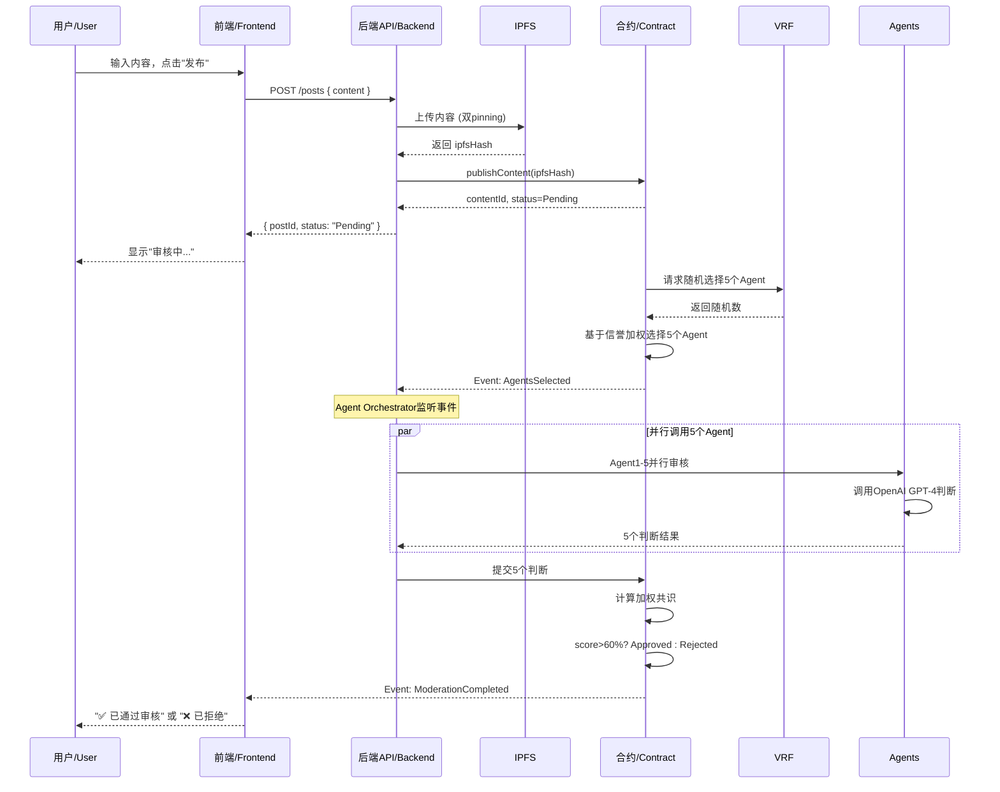

# Trustless SocialFi 全栈架构文档 / Fullstack Architecture Document

## 介绍 / Introduction

本文档概述了 **Trustless SocialFi** 的完整全栈架构，包括后端系统、前端实现、智能合约层及其集成。本文档是 AI 驱动开发的唯一权威信息源，确保整个技术栈的一致性。

_This document outlines the complete fullstack architecture for **Trustless SocialFi**, including backend systems, frontend implementation, smart contract layer, and their integration. It serves as the single source of truth for AI-driven development, ensuring consistency across the entire technology stack._

Trustless SocialFi 是首个基于 ERC-8004 Trustless Agent 标准实现 **AI Agent 去中心化内容治理**的去中心化社交媒体平台。平台使用多 Agent 共识机制（借鉴 Chainlink 预言机验证模式）在发布前审核内容，同时通过专属 AI Agent 为每位用户提供个性化推荐，所有决策过程在链上透明可验证。

_Trustless SocialFi is the first decentralized social media platform implementing **AI Agent-driven decentralized content governance** based on the ERC-8004 Trustless Agent standard. The platform uses a multi-agent consensus mechanism (inspired by Chainlink's oracle verification model) to moderate content before publication._

### 架构核心特性 / Core Architecture Features

本架构专门设计以支持：

- **多 Agent 内容审核 / Multi-Agent Content Moderation**: VRF 随机 Agent 选择、独立审核、加权共识投票
- **动态信誉系统 / Dynamic Reputation System**: Agent 和用户信誉计算，带时间衰减机制
- **Layer 2 部署 / Layer 2 Deployment**: 低 Gas 费用（<$0.10/笔交易）和快速交互（Arbitrum）
- **去中心化存储 / Decentralized Storage**: IPFS 内容存储，双 Pinning（Pinata + Web3.Storage）
- **DAO 治理 / DAO Governance**: 社区控制的内容合规规则，紧急提案快速通道

### 技术栈概览 / Technology Stack Overview

- **智能合约 / Smart Contracts**: Foundry + Solidity 0.8.24 + OpenZeppelin + Arbitrum One
- **后端 / Backend**: TypeScript + Node.js 20 + Fastify + viem + Prisma + PostgreSQL
- **前端 / Frontend**: Next.js 14 + React 18 + TypeScript + viem + wagmi + RainbowKit + shadcn/ui
- **基础设施 / Infrastructure**: Docker + Kubernetes + Turborepo (Monorepo)

### 项目类型 / Starter Template or Existing Project

**状态 / Status:** N/A - 全新项目 / Greenfield project

这是一个从零开始构建的全新项目，使用行业标准工具和框架。虽然不基于特定的启动模板，但架构采用了经过验证的模式。

_This is a greenfield project built from scratch using industry-standard tools and frameworks. The architecture leverages proven patterns without constraints from starter templates._

### 变更日志 / Change Log

| 日期 / Date | 版本 / Version | 描述 / Description                           | 作者 / Author       |
| ----------- | -------------- | -------------------------------------------- | ------------------- |
| 2025-10-10  | 1.0            | 初始架构文档 / Initial architecture document | Winston (Architect) |

---

## 高层架构 / High Level Architecture

### 技术概要 / Technical Summary

Trustless SocialFi 采用**三层全栈架构**，结合智能合约（Arbitrum L2）、后端服务（TypeScript 微服务）和现代 Web 前端（Next.js）。系统通过经济激励和信誉评分机制协调多个 AI Agent 进行去中心化内容审核。

_Trustless SocialFi adopts a **three-layer fullstack architecture** combining smart contracts (Arbitrum L2), backend services (TypeScript microservices), and a modern web frontend (Next.js). The system orchestrates multiple AI agents for decentralized content moderation through economic incentives and reputation scoring._

**整体架构风格 / Overall Architectural Style**: 混合式去中心化架构 - Layer 2 区块链存储关键状态（Agent 选择、共识投票、信誉评分），IPFS 存储内容，传统后端服务处理性能关键操作（Agent 编排、数据索引、API 网关）。

**前后端选择 / Frontend & Backend Choices**: Next.js 14 的 App Router 提供优秀的 SEO、服务端渲染和开发体验。Fastify 后端提供比 Express 高 2-3 倍的吞吐量，适合高频 Agent API 调用。全栈 TypeScript 确保从智能合约到 UI 组件的类型安全。

**关键集成点 / Key Integration Points**:

- **前端 ↔ 区块链 / Frontend ↔ Blockchain**: viem + wagmi 实现钱包连接和合约交互
- **后端 ↔ 区块链 / Backend ↔ Blockchain**: viem 读取事件、提交 Agent 判断、更新信誉
- **后端 ↔ AI 服务 / Backend ↔ AI Services**: OpenAI GPT-4 API 内容审核（MVP），未来迁移至自托管 LLM
- **所有层 ↔ IPFS / All Layers ↔ IPFS**: 通过 Pinata 和 Web3.Storage 上传/检索内容

**基础设施平台 / Infrastructure Platform**: AWS/GCP 部署后端服务（Kubernetes），Vercel 部署前端（自动 CI/CD），Arbitrum One 部署智能合约。多区域部署（US-East、EU-West）实现全球 < 200ms API 延迟。

**实现 PRD 目标 / Achieving PRD Goals**: 架构直接支持所有核心需求 - 多 Agent 共识、<30 秒审核时间、<$0.10 Gas 费用、99% 正常运行时间、透明可审计性。

### 平台和基础设施选择 / Platform and Infrastructure Choice

**平台 / Platform:** AWS (后端服务) + Arbitrum One (智能合约) + Vercel (前端)

**核心服务 / Key Services:**

- **计算 / Compute**: AWS EKS (Kubernetes) 运行 Agent 服务和 API 网关
- **数据库 / Database**: AWS RDS PostgreSQL 15 (Multi-AZ 高可用)
- **缓存 / Cache**: AWS ElastiCache Redis 7
- **存储 / Storage**: AWS S3 (备份), IPFS (Pinata + Web3.Storage 存储内容)
- **区块链 / Blockchain**: Arbitrum One (智能合约), Alchemy (RPC 提供商)
- **前端 / Frontend**: Vercel (Next.js 托管，边缘缓存)
- **监控 / Monitoring**: AWS CloudWatch + Prometheus + Grafana + Sentry

**部署主机和区域 / Deployment Host and Regions:**

- **后端 / Backend**: AWS us-east-1 (主要), eu-west-1 (次要，降低延迟)
- **智能合约 / Smart Contracts**: Arbitrum One 主网 (全球 L2 网络)
- **前端 / Frontend**: Vercel 全球边缘网络 (自动地理路由)

### 仓库结构 / Repository Structure

**结构 / Structure:** Monorepo (Turborepo + pnpm)

**Monorepo 工具 / Monorepo Tool:** Turborepo 1.11+ with pnpm 8+

**包组织 / Package Organization:**

```
trustless-socialfi/
├── apps/
│   ├── web/                      # Next.js 前端 / Frontend (Port 3000)
│   └── api/                      # Fastify 后端 / Backend (Port 3001)
├── packages/
│   ├── contracts/                # Foundry 智能合约 / Smart contracts
│   ├── shared/                   # 共享类型和工具 / Shared types & utilities
│   ├── ui/                       # 共享 React 组件 / Shared React components
│   └── config/                   # 共享配置 / Shared configs
├── infrastructure/
│   ├── kubernetes/               # K8s 清单 / K8s manifests
│   └── terraform/                # 基础设施即代码 / Infrastructure as Code
├── scripts/                      # 构建和部署脚本 / Build & deployment scripts
└── turbo.json                    # Turborepo 配置 / Turborepo config
```

---

## 技术栈 / Tech Stack

这是 Trustless SocialFi 项目的**权威**技术选型。除非经过明确批准的变更请求，所有开发必须使用这些确切的版本。

_This is the **DEFINITIVE** technology selection for the entire Trustless SocialFi project. All development must use these exact versions unless explicitly approved through a change request._

### 技术栈表格 / Technology Stack Table

| 类别 / Category | 技术 / Technology    | 版本 / Version | 用途 / Purpose        | 理由 / Rationale                                        |
| --------------- | -------------------- | -------------- | --------------------- | ------------------------------------------------------- |
| 前端语言        | TypeScript           | 5.3+           | 类型安全的前端开发    | 防止运行时错误，IntelliSense 支持，强制 strict 模式     |
| 前端框架        | Next.js              | 14.1+          | React 框架 (SSR/SSG)  | App Router + React 服务端组件，流式 SSR，一流 SEO       |
| UI 组件库       | shadcn/ui            | 0.8+           | 可访问的组件原语      | 基于 Radix UI (WAI-ARIA)，高度可定制，零供应商锁定      |
| 状态管理        | Zustand              | 4.5+           | 轻量级 React 状态管理 | 比 Redux 小 10 倍，更简单的 API，TypeScript 优先        |
| 后端语言        | TypeScript           | 5.3+           | 类型安全的后端开发    | 全栈统一语言，前后端共享类型                            |
| 后端框架        | Fastify              | 4.26+          | 高性能 Web 框架       | 比 Express 快 2-3 倍，原生 TypeScript，schema 验证      |
| API 风格        | RESTful HTTP         | -              | 标准 HTTP API         | 比 GraphQL 简单，清晰的端点                             |
| 数据库          | PostgreSQL           | 15+            | 关系型数据库          | ACID 合规，JSON 支持，Prisma 类型安全查询               |
| 缓存            | Redis                | 7+             | 内存缓存和任务队列    | Bull 队列处理异步任务，会话存储，限流                   |
| 文件存储        | IPFS                 | -              | 去中心化内容存储      | 双 Pinning (Pinata + Web3.Storage)，内容寻址            |
| 认证            | 钱包签名             | EIP-712        | Web3 原生认证         | MetaMask 签名，viem 验证，无密码                        |
| 前端测试        | Vitest               | 1.2+           | 快速单元测试运行器    | 比 Jest 快 10 倍，原生 ESM，React Testing Library       |
| 后端测试        | Jest                 | 29+            | 后端单元/集成测试     | Supertest 集成，出色的 mock，80% 覆盖率                 |
| E2E 测试        | Playwright           | 1.41+          | 跨浏览器端到端测试    | 比 Cypress 快，自动等待，强大调试                       |
| 构建工具        | Turborepo            | 1.12+          | Monorepo 任务编排     | 缓存构建输出，CI/CD 提速 40-60%                         |
| 打包工具        | Turbopack            | 14.1+          | 前端资源打包          | 比 Webpack 快 10 倍 (Rust 实现)                         |
| 基础设施即代码  | Terraform            | 1.7+           | 基础设施即代码        | 声明式 AWS 资源管理，Helm 管理 K8s                      |
| CI/CD           | GitHub Actions       | -              | 自动化测试和部署      | Turborepo 缓存集成，Vercel 自动部署                     |
| 监控            | Prometheus + Grafana | 2.49+ / 10+    | 指标收集和可视化      | Prometheus 抓取指标，Grafana 仪表板                     |
| 日志            | Pino                 | 8.18+          | 结构化 JSON 日志      | 比 Winston 快 5 倍，请求关联                            |
| CSS 框架        | Tailwind CSS         | 3.4+           | 实用优先的 CSS 框架   | 快速开发，设计系统一致性                                |
| 智能合约语言    | Solidity             | 0.8.24         | 以太坊智能合约        | 最新稳定版，OpenZeppelin 5.0 支持                       |
| 智能合约框架    | Foundry              | 0.2.0+         | 合约开发工具包        | Rust 实现（快速），强大测试，gas 快照                   |
| 区块链          | Arbitrum One         | -              | 以太坊 Layer 2        | <$0.10 gas 费，完全 EVM 兼容，Chainlink VRF 支持        |
| Web3 库         | viem                 | 2.7+           | TypeScript 以太坊库   | 比 ethers.js 快 10 倍，更好的 TypeScript，40KB vs 300KB |
| 钱包集成        | RainbowKit           | 2.0+           | React 钱包连接 UI     | 美观 UX，支持 MetaMask/WalletConnect                    |
| 合约交互        | wagmi                | 2.5+           | 以太坊 React hooks    | 类型安全的合约调用，自动缓存                            |
| 数据索引        | The Graph            | Hosted         | 区块链数据索引        | GraphQL API，实时更新，减少 90% RPC 调用                |
| 随机数          | Chainlink VRF        | v2.5           | 可验证随机函数        | 密码学安全随机性，Arbitrum 原生支持                     |
| AI 服务 (MVP)   | OpenAI GPT-4 Turbo   | gpt-4-turbo    | 内容审核              | 85%+ 准确率，$0.01/1K tokens，12 个月后迁移至 Llama 3   |
| 容器运行时      | Docker               | 24+            | 应用容器化            | 可复现构建，一致环境                                    |
| 容器编排        | Kubernetes (EKS)     | 1.29+          | 容器编排              | 自动扩展，自愈，滚动更新                                |
| 包管理器        | pnpm                 | 8.15+          | 快速包管理器          | 比 npm 快 3 倍，内容寻址存储                            |
| 代码质量        | ESLint + Prettier    | 8+ / 3+        | 代码检查和格式化      | TypeScript 规则，Husky 预提交钩子                       |
| 错误追踪        | Sentry               | latest         | 错误监控和告警        | 前后端统一，source maps，Slack 集成                     |

---

## 数据模型 / Data Models

本节定义了前端、后端和智能合约之间共享的核心数据模型。

_This section defines the core data models that will be shared between frontend, backend, and smart contracts._

### 用户 / User

**用途 / Purpose**: 表示一个基于钱包身份的注册用户。

_Represents a registered user with wallet-based identity._

**关键属性 / Key Attributes:**

- `id`: UUID - 主键 / Primary key
- `walletAddress`: string - 以太坊地址（唯一，小写）/ Ethereum address (unique, lowercase)
- `username`: string? - 可选显示名称 / Optional display name
- `bio`: string? - 用户简介（最多 280 字符）/ User biography (max 280 characters)
- `reputationScore`: number - 用户信誉（0-100）/ User reputation (0-100)
- `createdAt`: DateTime - 注册时间戳 / Registration timestamp

**TypeScript 接口 / TypeScript Interface:**

```typescript
interface User {
  id: string;
  walletAddress: `0x${string}`;
  username?: string | null;
  bio?: string | null;
  avatarUrl?: string | null;
  reputationScore: number; // 0-100
  preferencesIpfsHash?: string | null;
  createdAt: Date;
  updatedAt: Date;
}
```

### 帖子 / Post (Content)

**用途 / Purpose**: 用户生成的内容，IPFS 存储，带审核状态。

_User-generated content with IPFS storage and moderation status._

```typescript
enum ContentStatus {
  Pending = "Pending", // 审核中 / Under review
  Approved = "Approved", // 已批准 / Approved
  Rejected = "Rejected", // 已拒绝 / Rejected
}

interface Post {
  id: string; // 匹配区块链 contentId / Matches blockchain contentId
  authorId: string; // 作者 UUID / Author UUID
  author?: User; // 作者信息 / Author info
  ipfsHash: string; // IPFS 内容哈希 / IPFS content hash
  contentPreview: string; // 前 280 字符预览 / First 280 chars preview
  status: ContentStatus; // 审核状态 / Moderation status
  moderationScore?: number | null; // 共识得分 0-100 / Consensus score 0-100
  likesCount: number; // 点赞数 / Like count
  commentsCount: number; // 评论数 / Comment count
  createdAt: Date; // 创建时间 / Creation time
  moderatedAt?: Date | null; // 审核完成时间 / Moderation completion time
}
```

### Agent / Agent

**用途 / Purpose**: 审核内容的 AI Agent，带质押和信誉。

_AI agent that moderates content with staking and reputation._

```typescript
interface Agent {
  id: string; // UUID
  walletAddress: `0x${string}`; // Agent 运营者地址 / Agent operator address
  serviceEndpoint: string; // HTTP API 端点 / HTTP API endpoint
  stakedAmount: bigint; // 质押金额（Wei）/ Staked amount (Wei)
  reputationScore: number; // 信誉评分 0-100 / Reputation score 0-100
  totalJudgments: number; // 总审核次数 / Total judgments
  accuracyRate: number; // 准确率 0-100% / Accuracy rate 0-100%
  isActive: boolean; // 是否活跃 / Whether active
  registeredAt: Date; // 注册时间 / Registration time
}
```

**其他模型 / Additional Models:** AgentJudgment (Agent 判断), Like (点赞), Comment (评论), Follow (关注), UserPreferences (用户偏好), Proposal (提案)

详见数据库 Schema 部分的完整定义。_See Database Schema section for complete definitions._

---

## API 规范 / API Specification

### REST API 概览 / REST API Overview

**基础 URL / Base URL**: `https://api.trustless-socialfi.xyz/v1`

**认证方式 / Authentication**: 钱包签名生成的 JWT (EIP-712) / JWT from wallet signature (EIP-712)

**关键端点 / Key Endpoints:**

#### 认证 / Authentication

- `GET /auth/nonce` - 获取签名用的 nonce / Get nonce for signature
- `POST /auth/verify` - 验证签名，获取 JWT / Verify signature, get JWT

#### 用户 / Users

- `POST /users/register` - 注册新用户 / Register new user
- `GET /users/{address}` - 获取用户档案 / Get user profile
- `GET /users/{id}/following` - 获取关注列表 / Get following list

#### 帖子 / Posts

- `POST /posts` - 创建帖子（触发审核）/ Create post (triggers moderation)
- `GET /posts` - 列出帖子（分页）/ List posts (paginated)
- `GET /posts/{id}` - 获取帖子详情 / Get post details
- `GET /posts/{id}/moderation` - 获取审核状态 / Get moderation status
- `POST /posts/{id}/like` - 点赞帖子 / Like post
- `POST /posts/{id}/comments` - 添加评论 / Add comment

#### Agent

- `GET /agents` - 列出 Agents（可排序、筛选）/ List agents (sortable, filterable)
- `GET /agents/{id}` - 获取 Agent 详情 / Get agent details
- `POST /agent/moderate` - Agent 审核端点 / Agent moderation endpoint

#### IPFS

- `POST /ipfs/upload` - 上传内容到 IPFS / Upload content to IPFS
- `GET /ipfs/{hash}` - 从 IPFS 检索内容 / Retrieve content from IPFS

**错误响应格式 / Error Response Format:**

```json
{
  "error": {
    "code": "CONTENT_TOO_LONG",
    "message": "Post content exceeds maximum length",
    "details": {
      "maxLength": 5000,
      "actualLength": 5234
    },
    "timestamp": "2024-10-10T12:34:56Z",
    "requestId": "req_abc123"
  }
}
```

_完整 OpenAPI 3.0 规范可在 `/docs` 端点和 `docs/api/openapi.json` 中查看。_

_Full OpenAPI 3.0 specification available at `/docs` endpoint and in `docs/api/openapi.json`._

---

## 组件 / Components

### 前端组件 / Frontend Components (Next.js)

**1. 认证与钱包管理 / Authentication & Wallet Management**

- **职责 / Responsibility**: 钱包连接、签名认证、钱包状态管理
- **关键接口 / Key Interfaces**: `connectWallet()`, `signMessage()`, `useAuth()` hook
- **技术栈 / Technology**: RainbowKit + wagmi + Zustand
- **依赖 / Dependencies**: API Client (认证验证)

**2. API 客户端与数据获取 / API Client & Data Fetching**

- **职责 / Responsibility**: 带认证、缓存、错误处理的 HTTP 客户端
- **关键接口 / Key Interfaces**: `apiClient.get/post/put/delete()`, React Query hooks
- **技术栈 / Technology**: TanStack Query + Zod 验证
- **依赖 / Dependencies**: Auth store (JWT tokens)

**3. 智能合约交互层 / Smart Contract Interaction**

- **职责 / Responsibility**: 类型安全的合约调用、交易管理
- **关键接口 / Key Interfaces**: `useContractRead()`, `useContractWrite()`, `useContractEvent()`
- **技术栈 / Technology**: wagmi + viem + 生成的 ABIs
- **依赖 / Dependencies**: @trustless/shared (合约地址/ABIs)

**4. UI 组件库 / UI Component Library**

- **职责 / Responsibility**: 可复用的可访问 UI 组件
- **关键接口 / Key Interfaces**: 原子组件 (Button, Input), 分子组件 (PostCard), 有机组件 (Feed)
- **技术栈 / Technology**: shadcn/ui + Radix UI + Tailwind CSS
- **依赖 / Dependencies**: None (自包含)

**5. 状态管理 / State Management**

- **职责 / Responsibility**: 全局应用状态
- **关键接口 / Key Interfaces**: `useAuthStore()`, `useUIStore()`
- **技术栈 / Technology**: Zustand with persist middleware
- **依赖 / Dependencies**: None

### 后端组件 / Backend Components (Fastify)

**6. API 网关与路由 / API Gateway & Router**

- **职责 / Responsibility**: HTTP 服务器、路由、验证、认证
- **关键接口 / Key Interfaces**: 路由处理器、中间件
- **技术栈 / Technology**: Fastify + Zod 验证 + JWT
- **依赖 / Dependencies**: 所有服务层组件

**7. Agent 编排器 / Agent Orchestrator**

- **职责 / Responsibility**: 监听事件、协调 Agent 调用、提交判断
- **关键接口 / Key Interfaces**: `startEventListener()`, `handleModeration()`
- **技术栈 / Technology**: viem (事件) + Bull (队列) + Redis
- **依赖 / Dependencies**: Agent 服务客户端、区块链服务

**8. IPFS 服务 / IPFS Service**

- **职责 / Responsibility**: 上传/检索内容，双 Pinning
- **关键接口 / Key Interfaces**: `uploadContent()`, `retrieveContent()`
- **技术栈 / Technology**: Pinata SDK + Web3.Storage + Redis 缓存
- **依赖 / Dependencies**: None

**9. 数据库仓储层 / Database Repository Layer**

- **职责 / Responsibility**: 抽象 Prisma 查询，提供事务支持
- **关键接口 / Key Interfaces**: `UserRepository`, `PostRepository`, `AgentRepository`
- **技术栈 / Technology**: Prisma ORM + PostgreSQL
- **依赖 / Dependencies**: None

---

## 数据库 Schema / Database Schema

完整的 Prisma schema，包含索引、约束和关系。详见 `apps/api/prisma/schema.prisma`。

_Complete Prisma schema with indexes, constraints, and relationships. See full schema in `apps/api/prisma/schema.prisma`._

**核心表 / Key Tables:**

- `users` - 用户档案和信誉 / User profiles and reputation
- `posts` - 内容元数据和状态 / Content metadata and status
- `agents` - Agent 注册表和性能 / Agent registry and performance
- `agent_judgments` - 单个 Agent 决策 / Individual agent decisions
- `likes` - 用户点赞 / User likes on posts
- `comments` - 帖子评论 / Post comments
- `follows` - 关注关系 / Follow relationships
- `proposals` - DAO 治理提案 / DAO governance proposals
- `user_preferences` - IPFS 哈希引用 / IPFS hash references

**性能索引 / Performance Indexes:**

- `idx_posts_status_created_at` - 时间线查询 / Timeline queries
- `idx_agents_active_reputation` - Agent 排行榜 / Agent leaderboard
- `idx_users_wallet_address` - 用户查找 / User lookups

**数据完整性 / Data Integrity:**

- 钱包地址唯一约束 / Unique constraints on wallet addresses
- 外键级联删除 / Foreign key cascades for data cleanup
- 检查约束（信誉 0-100）/ Check constraints (reputation 0-100)

---

## 前端架构 / Frontend Architecture

### 组件架构 / Component Architecture

**组件组织 / Component Organization:**

```
apps/web/src/
├── app/                          # Next.js App Router
│   ├── (auth)/                   # 需认证路由 / Authenticated routes
│   │   ├── feed/page.tsx         # 时间线 / Timeline
│   │   ├── profile/[address]/page.tsx  # 用户主页 / User profile
│   │   ├── agents/page.tsx       # Agent 列表 / Agent list
│   │   ├── preferences/page.tsx  # 用户偏好 / User preferences
│   │   └── governance/page.tsx   # DAO 治理 / DAO governance
│   ├── layout.tsx                # 根布局 / Root layout
│   ├── page.tsx                  # 落地页 / Landing page
│   └── providers.tsx             # 应用 Providers / App providers
├── components/
│   ├── ui/                       # shadcn/ui 原语 / primitives
│   ├── atoms/                    # 基础组件 / Basic components
│   ├── molecules/                # 组合组件 / Composed components
│   └── organisms/                # 复杂特性 / Complex features
├── hooks/                        # 自定义 React hooks / Custom React hooks
├── lib/                          # 工具函数 / Utilities
└── stores/                       # Zustand 状态存储 / Zustand stores
```

### 状态管理 / State Management

**状态架构 / State Architecture:**

- **服务端状态 / Server State** (React Query): API 数据、区块链数据
- **客户端状态 / Client State** (Zustand): 认证 token、UI 状态、偏好设置
- **表单状态 / Form State** (React Hook Form): 表单输入、验证
- **URL 状态 / URL State** (Next.js): 分页、筛选器

### 路由 / Routing

**路由列表 / Routes:**

- `/` - 落地页（公开）/ Landing page (public)
- `/feed` - 时间线（需认证）/ Timeline (authenticated)
- `/profile/[address]` - 用户主页（公开）/ User profile (public)
- `/agents` - Agent 目录（公开）/ Agent directory (public)
- `/governance` - DAO 提案（公开）/ DAO proposals (public)
- `/preferences` - 用户设置（需认证）/ User settings (authenticated)

**受保护路由模式 / Protected Route Pattern**: Next.js 中间件检查 JWT token，未认证用户重定向。

_Next.js middleware checks JWT token, redirects unauthenticated users._

---

## 后端架构 / Backend Architecture

### 服务架构 / Service Architecture

**传统服务器架构（Kubernetes）/ Traditional Server (Kubernetes)** - 长期运行的进程用于 Agent 编排和事件监听。

_Long-running processes for Agent orchestration and event listening._

**控制器组织 / Controller Organization:**

```
apps/api/src/
├── routes/                       # API 端点 / API endpoints
│   ├── auth.routes.ts            # 认证路由 / Auth routes
│   ├── users.routes.ts           # 用户路由 / User routes
│   ├── posts.routes.ts           # 帖子路由 / Post routes
│   └── agents.routes.ts          # Agent 路由 / Agent routes
├── services/                     # 业务逻辑 / Business logic
│   ├── AgentOrchestrator.ts      # Agent 编排器 / Agent orchestrator
│   ├── IPFSService.ts            # IPFS 服务 / IPFS service
│   ├── ModerationService.ts      # 审核服务 / Moderation service
│   └── BlockchainService.ts      # 区块链服务 / Blockchain service
├── repositories/                 # 数据访问 / Data access
│   ├── UserRepository.ts         # 用户仓储 / User repository
│   └── PostRepository.ts         # 帖子仓储 / Post repository
└── middleware/                   # Fastify 中间件 / Fastify middleware
    ├── auth.ts                   # 认证中间件 / Auth middleware
    ├── rateLimit.ts              # 限流中间件 / Rate limit middleware
    └── errorHandler.ts           # 错误处理器 / Error handler
```

### 认证流程 / Authentication Flow

1. 前端请求 nonce / Frontend requests nonce (`GET /auth/nonce`)
2. 用户用钱包签名消息 / User signs message with wallet
3. 后端用 viem 验证签名 / Backend verifies signature with viem
4. 后端生成 JWT（24 小时有效期）/ Backend generates JWT (24h expiry)
5. 后续请求在 Authorization header 中包含 JWT / Subsequent requests include JWT in Authorization header

---

## 统一项目结构 / Unified Project Structure

为 Turborepo 和 pnpm workspaces 优化的完整 monorepo 结构。

_Complete monorepo structure optimized for Turborepo and pnpm workspaces._

```
trustless-socialfi/
├── apps/
│   ├── web/                      # Next.js 前端 / Next.js frontend
│   └── api/                      # Fastify 后端 / Fastify backend
├── packages/
│   ├── contracts/                # Foundry 合约 / Foundry contracts
│   ├── shared/                   # 共享类型 / Shared types
│   ├── ui/                       # 组件库 / Component library
│   └── config/                   # 共享配置 / Shared configs
├── infrastructure/
│   ├── terraform/                # AWS IaC
│   └── kubernetes/               # K8s 清单 / K8s manifests
├── scripts/                      # 自动化脚本 / Automation scripts
├── docs/                         # 文档 / Documentation
├── turbo.json                    # Turborepo 配置 / Turborepo config
├── pnpm-workspace.yaml           # pnpm 工作空间 / pnpm workspaces
└── docker-compose.yml            # 本地开发服务 / Local dev services
```

**关键配置文件 / Key Configuration Files:**

- `turbo.json` - 构建管道和缓存 / Build pipeline and caching
- `pnpm-workspace.yaml` - 包管理 / Package management
- `docker-compose.yml` - PostgreSQL, Redis, Anvil

---

## 开发工作流 / Development Workflow

### 本地环境设置 / Local Setup

```bash
# 1. 克隆并安装 / Clone and install
git clone <repo>
pnpm install

# 2. 设置环境变量 / Setup environment
cp .env.example .env
# 编辑并填入您的 API keys / Edit with your API keys

# 3. 启动服务 / Start services
docker-compose up -d  # PostgreSQL, Redis, Anvil

# 4. 设置数据库 / Setup database
cd apps/api
pnpm prisma migrate dev
pnpm prisma db seed

# 5. 本地部署合约 / Deploy contracts locally
cd packages/contracts
forge build && forge test
./script/deploy-local.sh

# 6. 启动开发服务器 / Start dev servers
cd ../..
pnpm dev  # 前端 Frontend (3000) + 后端 Backend (3001)
```

### 开发命令 / Development Commands

```bash
# 启动所有服务 / Start all services
pnpm dev

# 运行测试 / Run tests
pnpm test                          # 所有测试 / All tests
pnpm test:contracts                # Foundry 测试 / Foundry tests
pnpm --filter @trustless/web test  # 仅前端 / Frontend only
pnpm --filter @trustless/api test  # 仅后端 / Backend only

# 代码检查和格式化 / Lint and format
pnpm lint
pnpm format

# 构建生产版本 / Build for production
pnpm build

# 数据库操作 / Database operations
cd apps/api
pnpm prisma migrate dev           # 运行迁移 / Run migrations
pnpm prisma studio                # 打开 GUI / Open GUI
```

---

## 部署架构 / Deployment Architecture

### 部署策略 / Deployment Strategy

**前端部署 / Frontend Deployment:**

- **平台 / Platform:** Vercel
- **构建命令 / Build:** `pnpm turbo build --filter=@trustless/web`
- **输出目录 / Output:** `apps/web/.next`
- **特性 / Features:** 自动 HTTPS、预览部署、边缘缓存

**后端部署 / Backend Deployment:**

- **平台 / Platform:** AWS EKS (Kubernetes)
- **构建方式 / Build:** Docker 多阶段构建
- **部署方法 / Method:** 滚动更新（零停机）/ Rolling update (zero downtime)
- **特性 / Features:** 自动扩展（2-10 个 pods）、健康检查、负载均衡器

### 环境 / Environments

| 环境 / Environment | 前端 URL / Frontend URL                | 后端 URL / Backend URL                     | 区块链 / Blockchain |
| ------------------ | -------------------------------------- | ------------------------------------------ | ------------------- |
| 开发 / Development | http://localhost:3000                  | http://localhost:3001                      | Anvil (本地)        |
| 预发布 / Staging   | https://staging.trustless-socialfi.xyz | https://staging-api.trustless-socialfi.xyz | Arbitrum Sepolia    |
| 生产 / Production  | https://trustless-socialfi.xyz         | https://api.trustless-socialfi.xyz         | Arbitrum One        |

### CI/CD 流水线 / CI/CD Pipeline

**GitHub Actions 工作流 / GitHub Actions workflows:**

- `ci.yml` - 每次 push/PR 时运行 Lint、测试、构建
- `deploy-staging.yml` - 自动部署到 Staging (develop 分支)
- `deploy-production.yml` - 手动部署到生产环境 (main 分支)

**部署步骤 / Deployment steps:**

1. 运行所有测试（合约、后端、前端）/ Run all tests (contracts, backend, frontend)
2. 构建 Docker 镜像 → 推送到 AWS ECR / Build Docker image → Push to AWS ECR
3. 部署到 Kubernetes → 滚动更新 / Deploy to Kubernetes → Rolling update
4. 运行冒烟测试 / Run smoke tests
5. 发送 Slack 通知 / Send Slack notification

---

## 安全和性能 / Security and Performance

### 安全要求 / Security Requirements

**前端安全 / Frontend Security:**

- **CSP Headers**: 严格的内容安全策略 / Strict Content-Security-Policy
- **XSS 防护 / XSS Prevention**: React 自动转义 + DOMPurify（富文本）
- **安全存储 / Secure Storage**: HttpOnly cookies 存储 JWT（不用 localStorage）

**后端安全 / Backend Security:**

- **输入验证 / Input Validation**: 所有请求使用 Zod schema 验证
- **限流 / Rate Limiting**: 一般 100 req/min，发帖 10 req/min
- **CORS 策略 / CORS Policy**: 仅白名单可信来源
- **SQL 注入防护 / SQL Injection**: Prisma 参数化查询

**认证安全 / Authentication Security:**

- **Token 存储 / Token Storage**: HttpOnly, Secure, SameSite=Strict cookies
- **会话管理 / Session Management**: JWT 24 小时有效期 + refresh tokens
- **Nonce 机制 / Nonce Mechanism**: 一次性 nonce 防止重放攻击

### 性能优化 / Performance Optimization

**前端 / Frontend:**

- **Bundle 大小 / Bundle Size**: < 300KB 初始 JS (gzipped)
- **加载策略 / Loading Strategy**: 代码分割、懒加载、动态导入
- **缓存策略 / Caching**: 静态资源（1 年），API 数据（React Query 30s stale）
- **图片优化 / Image Optimization**: Next.js Image 组件，AVIF/WebP 格式

**后端 / Backend:**

- **响应时间 / Response Time**: P50 < 200ms, P95 < 500ms, P99 < 1s
- **数据库 / Database**: 索引查询、连接池（最多 100）
- **缓存 / Caching**: Redis 缓存热点数据（用户、Agent、IPFS 内容）
- **压缩 / Compression**: Gzip/Brotli 响应压缩

**关键性能目标 / Critical Performance Target:**

- **内容审核 / Content Moderation**: < 30 秒端到端（IPFS 上传 → Agent 判断 → 共识 → 结果）

---

## 测试策略 / Testing Strategy

### 测试金字塔 / Testing Pyramid

```
        E2E (5%)              端到端测试
       /         \
   Integration (15%)          集成测试
  /                  \
Frontend Unit (40%)  Backend Unit (40%)
前端单元测试          后端单元测试
```

### 覆盖率要求 / Coverage Requirements

- **智能合约 / Smart Contracts**: > 90% (Foundry)
- **后端 / Backend**: > 80% (Jest + Supertest)
- **前端 / Frontend**: > 70% (Vitest + React Testing Library)
- **E2E**: 仅关键流程 / Critical flows only (Playwright)

### 测试组织 / Test Organization

**前端 / Frontend:** `apps/web/__tests__/`

- 组件、hooks、服务、E2E / Components, hooks, services, E2E

**后端 / Backend:** `apps/api/__tests__/`

- 路由、服务、仓储、集成 / Routes, services, repositories, integration

**合约 / Contracts:** `packages/contracts/test/`

- 单元测试、模糊测试、集成测试 / Unit tests, fuzz tests, integration tests

### 关键测试示例 / Key Test Examples

**前端组件测试 / Frontend Component Test:**

```typescript
it("renders post card with correct data", () => {
  render(<PostCard post={mockPost} />);
  expect(screen.getByText(mockPost.contentPreview)).toBeInTheDocument();
});
```

**后端 API 测试 / Backend API Test:**

```typescript
it("creates post with valid auth", async () => {
  const response = await app.inject({
    method: "POST",
    url: "/v1/posts",
    headers: { authorization: `Bearer ${token}` },
    payload: { content: "Test post" },
  });
  expect(response.statusCode).toBe(201);
});
```

**智能合约测试 / Smart Contract Test:**

```solidity
function testWeightedConsensus() public {
    // 设置5个不同信誉的Agent / Setup 5 agents with different reputations
    // 提交混合判断(3批准,2拒绝) / Submit mixed judgments (3 approve, 2 reject)
    // 验证加权得分计算 / Verify weighted score calculation
}
```

---

## 编码规范 / Coding Standards

### 关键全栈规则 / Critical Fullstack Rules

**1. 类型共享 / Type Sharing:**

始终在 `packages/shared` 定义类型，从 `@trustless/shared` 导入。

_Always define types in `packages/shared` and import from `@trustless/shared`._

**2. API 调用 / API Calls:**

不要直接发起 HTTP 请求 - 始终使用 API 客户端服务层。

_Never make direct HTTP calls - use API client service layer._

**3. 环境变量 / Environment Variables:**

仅通过 Zod 验证的配置对象访问，不要直接使用 `process.env`。

_Access only through config objects with Zod validation, never `process.env` directly._

**4. 错误处理 / Error Handling:**

所有异步函数必须有 try-catch，使用标准错误处理器。

_All async functions must have try-catch, use standard error handler._

**5. 状态更新 / State Updates:**

不要直接修改状态 - 使用 Zustand `set()` 或 React `setState()`。

_Never mutate state directly - use Zustand `set()` or React `setState()`._

**6. Token 金额使用 BigInt:**

对于 Wei 金额（18 位小数）始终使用 `bigint`，不要用 `number`。

_Always use `bigint` for Wei amounts (18 decimals), never `number`._

**7. 钱包地址规范化 / Wallet Address Normalization:**

存储/比较前始终将钱包地址转为小写。

_Always lowercase wallet addresses before storage/comparison._

### 命名约定 / Naming Conventions

| 元素 / Element    | 前端 / Frontend   | 后端 / Backend | 智能合约 / Contracts | 示例 / Example      |
| ----------------- | ----------------- | -------------- | -------------------- | ------------------- |
| 组件 / Components | PascalCase        | -              | -                    | `UserProfile.tsx`   |
| Hooks             | camelCase + 'use' | -              | -                    | `useAuth.ts`        |
| API 路由          | -                 | kebab-case     | -                    | `/api/user-profile` |
| 数据库表          | -                 | snake_case     | -                    | `user_preferences`  |
| 合约 / Contracts  | -                 | -              | PascalCase           | `TrustToken.sol`    |
| 函数 / Functions  | camelCase         | camelCase      | camelCase            | `formatAddress()`   |

### 代码风格 / Code Style

- **TypeScript**: Strict 模式，优先类型推断，使用 const assertions
- **React**: 函数式组件，命名导出，TypeScript props
- **Solidity**: 遵循风格指南，使用自定义错误（gas 高效）
- **导入顺序 / Imports**: 外部 → 内部 → 相对 → 样式
- **注释 / Comments**: 解释"为什么"而非"是什么"，公共 API 使用 JSDoc

---

## 错误处理策略 / Error Handling Strategy

### 错误响应格式 / Error Response Format

```json
{
  "error": {
    "code": "CONTENT_TOO_LONG",
    "message": "Post content exceeds maximum length",
    "details": {
      "maxLength": 5000,
      "actualLength": 5234
    },
    "timestamp": "2024-10-10T12:34:56Z",
    "requestId": "req_abc123"
  }
}
```

### 前端错误处理 / Frontend Error Handling

- **ErrorBoundary**: 捕获 React 错误，上报到 Sentry / Catch React errors, report to Sentry
- **API 错误 / API Errors**: 将错误码映射为用户友好消息 / Map error codes to user-friendly messages
- **Toast 通知 / Toast Notifications**: 使用 `sonner` 库显示错误/成功 / Show errors/success with `sonner` library

### 后端错误处理 / Backend Error Handling

- **自定义错误类 / Custom Error Classes**: `ValidationError`, `AuthenticationError`, `NotFoundError`
- **全局错误处理器 / Global Error Handler**: 标准化响应、日志记录、Sentry 集成
- **重试逻辑 / Retry Logic**: IPFS/OpenAI 调用的指数退避
- **熔断器 / Circuit Breaker**: 防止级联故障（OpenAI 服务宕机时）

### 智能合约错误 / Smart Contract Errors

```solidity
// 自定义错误 (gas高效) / Custom errors (gas-efficient)
error InsufficientStake(uint256 required, uint256 provided);
error AgentNotActive(address agent);

// 使用 / Usage
if (amount < MIN_STAKE) {
    revert InsufficientStake(MIN_STAKE, amount);
}
```

---

## 监控和可观测性 / Monitoring and Observability

### 监控栈 / Monitoring Stack

- **前端 / Frontend**: Sentry (错误) + Vercel Analytics (Web Vitals)
- **后端 / Backend**: Prometheus (指标) + Grafana (仪表板) + Pino (日志)
- **错误追踪 / Error Tracking**: Sentry (前后端统一)
- **正常运行时间 / Uptime**: 外部监控 (Uptime Robot)

### 关键指标 / Key Metrics

**前端指标 / Frontend:**

- Core Web Vitals (LCP, FID, CLS)
- JavaScript 错误 / JavaScript errors
- API 响应时间 / API response times
- 钱包连接成功率 / Wallet connection success rate

**后端指标 / Backend:**

- 请求速率 / Request rate (req/sec)
- 错误率 / Error rate (%)
- 响应时间 / Response time (P50, P95, P99)
- 数据库查询性能 / Database query performance
- Agent 审核持续时间 / Agent moderation duration

**业务指标 / Business Metrics:**

- 日活跃用户 / Daily Active Users (DAU)
- 创建的帖子（按状态）/ Posts created (by status)
- 活跃 Agent 数量 / Active agents count
- 平均审核时间 / Average moderation time
- Agent 共识率 / Agent consensus rate

### 告警规则 / Alerting

**严重告警 / Critical Alerts** (PagerDuty):

- API 错误率 > 5% 持续 5 分钟
- 活跃 Agent < 20 个持续 5 分钟
- 数据库连接 > 90% 持续 5 分钟
- OpenAI 熔断器开启

**警告告警 / Warning Alerts** (Slack):

- API P95 延迟 > 1s 持续 10 分钟
- 平均审核时间 > 30s 持续 10 分钟
- IPFS 上传失败率 > 10% 持续 5 分钟

---

## 架构决策记录 / Architecture Decision Records

### ADR-001: 使用 Turborepo Monorepo / Use Turborepo Monorepo

**状态 / Status**: 已接受 / Accepted

**背景 / Context**: 需要在前端、后端和合约之间共享类型。

_Need to share types between frontend, backend, and contracts._

**决策 / Decision**: 使用 Turborepo monorepo 和 pnpm workspaces。

**后果 / Consequences**:

- ✅ 通过 `@trustless/shared` 共享类型
- ✅ 跨栈原子化变更
- ✅ CI/CD 提速 40-60%（缓存）
- ❌ 初始设置稍复杂

### ADR-002: 使用 Fastify 而非 Express / Use Fastify over Express

**状态 / Status**: 已接受 / Accepted

**背景 / Context**: 需要高吞吐量后端处理 Agent API 调用。

_Need high-throughput backend for Agent API calls._

**决策 / Decision**: 使用 Fastify 代替 Express。

**后果 / Consequences**:

- ✅ 性能提升 2-3 倍
- ✅ 原生 TypeScript 支持
- ✅ 内置 schema 验证
- ❌ 生态系统比 Express 小

### ADR-003: 使用 viem 而非 ethers.js / Use viem over ethers.js

**状态 / Status**: 已接受 / Accepted

**背景 / Context**: 需要现代化的 Web3 库，优秀的 TypeScript 支持。

_Need modern Web3 library with excellent TypeScript support._

**决策 / Decision**: 所有区块链交互使用 viem。

**后果 / Consequences**:

- ✅ 快 10 倍，bundle 40KB vs 300KB
- ✅ 更好的 TypeScript 类型推断
- ✅ 现代 API（原生 BigInt）
- ❌ 较新的库，Stack Overflow 答案较少

### ADR-004: 使用 PostgreSQL 而非 MongoDB / PostgreSQL over MongoDB

**状态 / Status**: 已接受 / Accepted

**背景 / Context**: 为后端服务选择数据库。

_Choose database for backend services._

**决策 / Decision**: 使用 PostgreSQL 配合 Prisma ORM。

**后果 / Consequences**:

- ✅ 关键数据的 ACID 事务
- ✅ 优秀的 TypeScript 集成（Prisma）
- ✅ JSONB 支持灵活 schema
- ❌ 水平扩展比 MongoDB 复杂

### ADR-005: OpenAI API (MVP) → 自托管 LLM (Post-MVP)

**状态 / Status**: 已接受 / Accepted

**背景 / Context**: Agent 审核需要 AI 模型进行内容分类。

_Agent moderation needs AI model for content classification._

**决策 / Decision**: MVP 使用 OpenAI GPT-4 Turbo API，10K MAU 后迁移至自托管 Llama 3。

**后果 / Consequences**:

- ✅ 快速 MVP 验证（< 2 周集成）
- ✅ 高准确率（85-90%）
- ❌ MVP 规模成本 $500-1000/月
- 📅 计划在 10K MAU 时迁移（成本降低 80%）

---

## 核心工作流程图 / Core Workflow Diagrams

### 用户发帖完整流程 / Complete Post Creation Flow



**总耗时 / Total Time**: 约 25-30 秒 / ~25-30 seconds

- IPFS 上传 / IPFS upload: 3-5s
- VRF 随机数 / VRF randomness: 2-3s
- Agent 并行审核 / Parallel agent review: 10-15s
- 共识计算 / Consensus calculation: 2-5s

---

## 智能合约详解 / Smart Contract Details

### 合约列表 / Contract List

| 合约名称 / Contract        | 作用 / Purpose      | 关键功能 / Key Functions                    |
| -------------------------- | ------------------- | ------------------------------------------- |
| **TrustToken.sol**         | ERC-20 原生代币     | 发行 1 亿代币，转账，授权，质押             |
| **UserRegistry.sol**       | 用户注册管理        | 注册用户，存储档案，多钱包关联              |
| **AgentRegistry.sol**      | Agent 注册和质押    | Agent 注册，质押代币，更新端点，罚没        |
| **ContentRegistry.sol**    | 内容元数据注册      | 发布内容，存储 IPFS 哈希，更新状态          |
| **AgentSelector.sol**      | VRF 随机 Agent 选择 | 请求随机数，基于信誉加权选择 5 个 Agent     |
| **ModerationWorkflow.sol** | 审核工作流和共识    | 接收 Agent 判断，计算加权共识，更新内容状态 |
| **ReputationSystem.sol**   | 信誉计算和时间衰减  | 更新 Agent/用户信誉，应用时间衰减，触发罚没 |
| **SocialGraph.sol**        | 社交关系管理        | 关注/取关，点赞/取消点赞，查询关系          |
| **Governance.sol**         | DAO 治理系统        | 创建提案，投票，执行提案                    |
| **ModerationRules.sol**    | 合规规则存储        | 存储规则，DAO 更新规则，Agent 读取规则      |

### 合约详细说明 / Detailed Contract Descriptions

#### 1. TrustToken.sol - 原生代币合约

**用途 / Purpose**: ERC-20 代币，用于质押、奖励、治理投票。

```solidity
// 核心功能 / Core Functions
function transfer(address to, uint256 amount) external returns (bool);
function approve(address spender, uint256 amount) external returns (bool);
function burn(uint256 amount) external;  // 代币销毁 / Token burning

// 参数 / Parameters
名称 / Name: "TrustToken"
符号 / Symbol: "$TRUST"
总量 / Total Supply: 100,000,000 tokens (1e8 * 1e18 wei)
```

#### 2. UserRegistry.sol - 用户注册合约

**用途 / Purpose**: 管理用户身份和档案。

```solidity
// 核心功能 / Core Functions
function registerUser() external;
// 创建用户记录，初始信誉50分

function updatePreferencesHash(string memory ipfsHash) external;
// 更新用户偏好数据的IPFS哈希（加密存储）

function linkWallet(address subWallet, bytes memory signature) external;
// 关联多个钱包（主钱包+最多5个子钱包）

function getUserProfile(address user) external view returns (UserProfile);
```

#### 3. AgentRegistry.sol - Agent 注册合约

**用途 / Purpose**: Agent 注册、质押管理、罚没机制。

```solidity
// 核心功能 / Core Functions
function registerAgent(string memory serviceEndpoint) external;
// 要求: 已授权合约转移 ≥1000 $TRUST
// 流程: 转移代币到合约 → 创建Agent记录 → 初始信誉50

function slashAgent(address agent, uint256 amount, string memory reason) external;
// 罚没质押金（连续错误或恶意行为）
// 罚没金额转入DAO金库
// 如果质押<最低要求，自动停用Agent

function getAgent(address agentAddress) external view returns (Agent);
function getAllAgents() external view returns (address[]);
```

**存储结构 / Storage Structure:**

```solidity
struct Agent {
    address agentAddress;       // Agent运营者地址
    string serviceEndpoint;     // HTTP API端点 (e.g., https://agent.com/moderate)
    uint256 stakedAmount;       // 质押金额（Wei）
    uint256 reputationScore;    // 信誉评分 (0-100)
    uint256 registeredAt;       // 注册时间戳
    bool isActive;              // 是否活跃（未被罚没）
}
```

#### 4. ContentRegistry.sol - 内容注册合约

**用途 / Purpose**: 记录所有内容的 IPFS 哈希和状态。

```solidity
function publishContent(string memory ipfsHash) external returns (uint256 contentId);
// 创建Content记录(status=Pending)
// 返回自增contentId

function updateStatus(uint256 contentId, ContentStatus status) external;
// 只能由ModerationWorkflow调用
// 审核完成后更新status为Approved/Rejected

function getContent(uint256 contentId) external view returns (Content);
function getUserContents(address author) external view returns (uint256[]);
function incrementLikes(uint256 contentId) external;
```

#### 5. AgentSelector.sol - VRF 随机选择合约

**用途 / Purpose**: 使用 Chainlink VRF 公平随机选择 5 个 Agent。

```solidity
function requestAgentSelection(uint256 contentId) external returns (uint256 requestId);
// 1. 调用Chainlink VRF requestRandomWords()
// 2. 存储requestId → contentId映射
// 3. 触发AgentSelectionRequested事件

function fulfillRandomWords(uint256 requestId, uint256[] memory randomWords) internal override;
// Chainlink VRF回调（2-3秒后）
// 1. 获取所有活跃Agent及其信誉
// 2. 基于信誉计算加权概率分布
//    例: Agent1信誉90 → 权重90, Agent2信誉50 → 权重50
//        选中概率: 90/140=64% vs 50/140=36%
// 3. 使用随机数选择5个不重复Agent
// 4. 触发AgentsSelected事件 → 后端监听
```

**防作弊机制 / Anti-cheat Mechanism:**

- VRF 提供可验证的随机性（无法预测）
- 高信誉 Agent 被选概率更高（激励诚实）
- 选择结果链上公开（透明度）

#### 6. ModerationWorkflow.sol - 审核工作流合约

**用途 / Purpose**: 协调整个审核流程，执行加权共识。

```solidity
function submitJudgment(uint256 contentId, bool decision, uint8 confidence) external;
// 由Agent调用（通过后端代理）
// 验证: msg.sender是选中的5个Agent之一
// 存储: 判断结果
// 触发: 5个都提交后自动executeConsensus()

function executeConsensus(uint256 contentId) internal;
// 加权共识算法:
// score = Σ(decision × confidence × agentReputation) / Σ(agentReputation)
//
// 示例计算:
// Agent1 (信誉90): Approve, 置信95 → 8550
// Agent2 (信誉80): Approve, 置信90 → 7200
// Agent3 (信誉70): Reject,  置信85 → -5950
// Agent4 (信誉60): Approve, 置信92 → 5520
// Agent5 (信誉50): Reject,  置信70 → -3500
//
// Approve总分: (8550+7200+5520) = 21270
// Reject总分: (5950+3500) = 9450
// 总权重: 90+80+70+60+50 = 350
// 最终得分: 21270/350 = 60.8% > 60% → Approved ✅

function getModerationResult(uint256 contentId) external view
    returns (bool approved, uint256 score, AgentJudgment[5] memory judgments);
```

**共识阈值 / Consensus Threshold**: 60% (可通过 DAO 调整)

#### 7. ReputationSystem.sol - 信誉系统合约

**用途 / Purpose**: 动态计算 Agent 和用户信誉，时间衰减。

```solidity
function updateAgentReputation(address agent, uint256 contentId, bool wasCorrect) external;
// 判断与共识一致: +10分
// 判断与共识不一致: -5分
// 应用时间衰减: score × 0.95^(周数)

function applyTimeDecay() external;
// 每周调用一次（定时任务）
// 所有Agent信誉 × 0.95
// 目的: 优先考虑近期表现

function updateUserReputation(address user) external;
// 基于发布内容质量:
// (点赞数 × 点赞者平均信誉 + 评论数×2 - 举报数×10) / 发布数

function checkSlashConditions(address agent) internal;
// 检查罚没条件:
// - 连续10次错误 → 罚没20%质押金
// - 极端错误(高置信度但完全错) → 罚没50%
```

**时间衰减示例 / Time Decay Example:**

```
Agent初始信誉: 80分
第1周后: 80 × 0.95 = 76分
第4周后: 80 × 0.95^4 = 65.2分
第8周后: 80 × 0.95^8 = 53.5分

→ 不活跃8周后，信誉降至中等水平
→ 激励Agent持续参与审核
```

#### 8. SocialGraph.sol - 社交图谱合约

**用途 / Purpose**: 管理关注和点赞关系。

```solidity
function follow(address userToFollow) external;
// 检查: 不能关注自己、不能重复关注
// 更新: following[msg.sender][userToFollow] = true

function likeContent(uint256 contentId) external;
// 1. 检查未重复点赞
// 2. 记录点赞和点赞者信誉（用于内容质量评分）
// 3. 调用ContentRegistry.incrementLikes()

function isFollowing(address follower, address following) external view returns (bool);
function getFollowers(address user) external view returns (address[]);
```

#### 9. Governance.sol - DAO 治理合约

**用途 / Purpose**: 社区提案和投票系统。

```solidity
function createProposal(
    string memory title,
    string memory description,
    string[] memory newRules
) external returns (uint256 proposalId);
// 要求: 提案者持有 ≥1000 $TRUST
// 创建提案，投票期7天（常规）或48小时（紧急）

function vote(uint256 proposalId, bool support) external;
// 投票权 = 代币余额
// 1代币 = 1票
// Phase 2: 二次方投票 (cost = votes²)

function executeProposal(uint256 proposalId) external;
// 验证: forVotes > 50%总量 且 > againstVotes
// 执行: 调用ModerationRules.updateRules()
```

**提案类型 / Proposal Types:**

- **标准提案 / Standard**: 7 天投票期
- **紧急提案 / Emergency**: 48 小时投票期，需要 ≥10% 活跃用户签名触发

#### 10. ModerationRules.sol - 规则存储合约

**用途 / Purpose**: 存储和管理内容合规规则。

```solidity
string[] public rules;  // 当前生效规则

function getRules() external view returns (string[] memory);
// Agent审核时调用，获取最新规则

function updateRules(string[] memory newRules, uint256 proposalId) external;
// 只能由Governance合约调用
// 更新规则 → 触发RulesUpdated事件 → 所有Agent同步
```

**创世规则 / Genesis Rules** (合约部署时):

1. 禁止暴力内容 / No violence
2. 禁止诈骗信息 / No scams
3. 禁止仇恨言论 / No hate speech
4. 禁止成人内容 / No NSFW
5. 禁止虚假信息 / No misinformation

**规则更新流程 / Rule Update Flow:**

```
社区成员创建提案 → DAO投票7天 → 通过(>50%)
→ 自动执行 → ModerationRules.updateRules()
→ RulesUpdated事件 → Agent重新加载规则
```

---

## 检查清单结果 / Checklist Results Report

_本节将在运行架构师检查清单后填充。_

_This section will be populated after running the architect checklist._

**检查清单状态 / Checklist Status**: 待处理 / Pending

**下一步 / Next Steps:**

1. 与团队审查本架构文档 / Review this architecture document with the team
2. 运行 `execute-checklist architect-checklist` 进行最终验证
3. 开始 Epic 1 实施（基础设施）/ Begin Epic 1 implementation (Foundation)
4. 按照本文档设置开发环境 / Setup development environment following this document

---

## 附录 / Appendix

### 术语表 / Glossary

- **Agent**: 审核内容并获得奖励的 AI 服务 / AI service that moderates content and earns rewards
- **VRF**: 可验证随机函数（Chainlink 服务）/ Verifiable Random Function (Chainlink service)
- **Consensus / 共识**: 5 个 Agent 的加权投票，批准/拒绝内容 / Weighted voting by 5 agents to approve/reject content
- **Reputation / 信誉**: 基于历史表现的动态评分（0-100）/ Dynamic score (0-100) based on historical performance
- **IPFS**: 星际文件系统（去中心化存储）/ InterPlanetary File System (decentralized storage)
- **Layer 2**: 以太坊扩容解决方案（Arbitrum）/ Ethereum scaling solution (Arbitrum)
- **DAO**: 去中心化自治组织 / Decentralized Autonomous Organization

### 参考资料 / References

- [PRD](./prd.md) - 产品需求文档 / Product Requirements Document
- [项目简报 / Project Brief](./brief.md) - 执行摘要和目标 / Executive summary and goals
- [竞品分析 / Competitor Analysis](./competitor-analysis.md) - 市场定位 / Market positioning
- [Foundry 文档](https://book.getfoundry.sh/)
- [Next.js 文档](https://nextjs.org/docs)
- [Fastify 文档](https://www.fastify.io/)
- [viem 文档](https://viem.sh/)
- [Arbitrum 文档](https://docs.arbitrum.io/)

### 联系方式 / Contact

如有架构问题或需要澄清 / For architecture questions or clarifications:

- **Winston** (Architect): 技术架构和设计决策 / Technical architecture and design decisions
- **GitHub Issues**: 技术讨论和提案 / Technical discussions and proposals
- **Discord**: #architecture 频道实时问答 / #architecture channel for real-time questions

---

**文档状态 / Document Status**: ✅ 完成 - 可开始实施 / Complete - Ready for implementation

**最后更新 / Last Updated**: 2025-10-10

**下次审查 / Next Review**: Epic 2 之前（Token Economy & Agent Registration）

---
