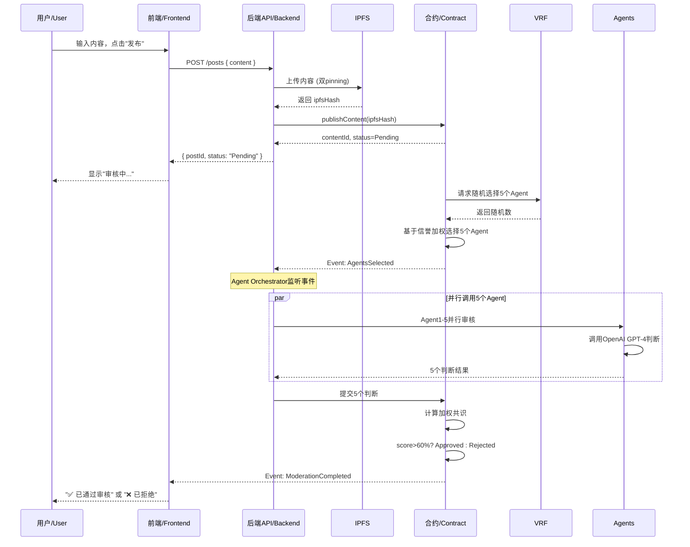

# 核心工作流程图 / Core Workflow Diagrams

## 用户发帖完整流程 / Complete Post Creation Flow

**总耗时 / Total Time**: 约 25-30 秒 / ~25-30 seconds

- IPFS 上传 / IPFS upload: 3-5s
- VRF 随机数 / VRF randomness: 2-3s
- Agent 并行审核 / Parallel agent review: 10-15s
- 共识计算 / Consensus calculation: 2-5s

---
